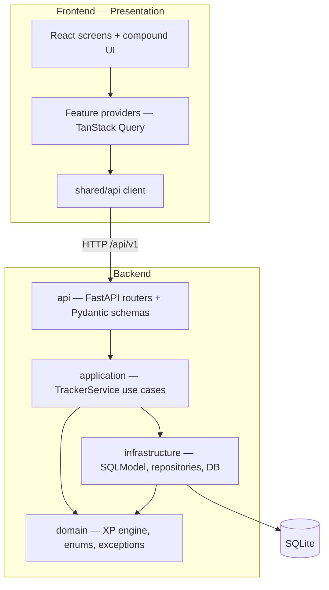
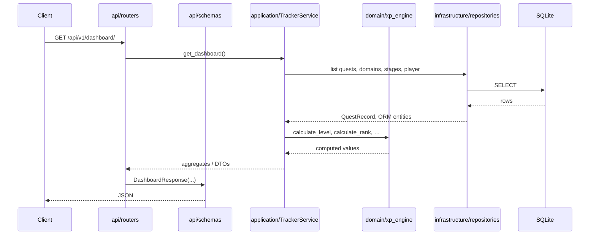
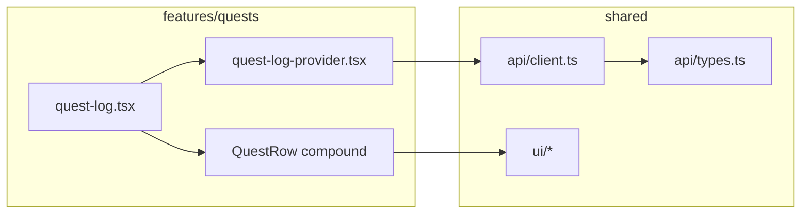

# RPG Tracker — Architecture

Clean Architecture monorepo: **domain → application → infrastructure → api** (backend) and **features → shared** (frontend). Dependencies point inward; frameworks and I/O stay at the edges.

## System overview



| Layer | Role | Must not depend on |
|-------|------|-------------------|
| **Domain** | Business rules, pure logic | Application, infrastructure, API, frameworks |
| **Application** | Use cases, orchestration, DTOs | API, FastAPI, SQLModel, HTTP |
| **Infrastructure** | Persistence, external I/O | API / HTTP layer |
| **API** | HTTP transport, validation, status codes | — (outermost backend shell) |
| **Frontend features** | Screen composition, local UI state | Direct `fetch` in leaf components |
| **Frontend shared** | API client, types, dumb UI primitives | Feature-specific state |

---

## Backend

### Directory layout

```
backend/src/rpg_tracker/
├── domain/                 # Innermost — no outward deps
│   ├── enums.py            # QuestStatus, QuestType, Priority
│   ├── exceptions.py       # QuestNotFoundError
│   └── xp_engine.py        # XP, level, rank, progress (pure functions)
├── application/            # Use cases
│   └── tracker_service.py  # TrackerService, QuestDTO, quest_to_dto
├── infrastructure/         # SQLite + SQLModel
│   ├── models.py           # ORM table models
│   ├── repositories.py     # QuestRepository, StageRepository, …
│   └── db.py               # Engine, session factory
├── api/                    # HTTP adapter
│   ├── deps.py             # DI: session → TrackerService
│   ├── schemas/            # Request/response Pydantic models
│   └── routers/            # dashboard, quests, roadmap, skills, domains
├── config.py               # Pydantic Settings (env)
├── main.py                 # FastAPI app wiring
└── seed/                   # SQL bootstrap for empty DB (not runtime domain)
```

### Request flow



### Layer responsibilities

#### Domain (`domain/`)

- **Owns:** rules that would survive a UI or database change.
- **Examples:** `calculate_xp`, `calculate_earned_xp`, `calculate_level`, `calculate_rank`, enum values, domain exceptions.
- **Rules:** no SQLModel, FastAPI, Pydantic, or `Session` imports.

#### Application (`application/`)

- **Owns:** use cases — list/update quests, build dashboard aggregates, roadmap/skill progress.
- **Returns:** application DTOs (`QuestDTO`, frozen dataclasses), not ORM models or raw dicts (target state).
- **Calls:** domain functions for all XP math; repository **ports** for data (target state).
- **Does not:** parse HTTP, choose status codes, or know about JSON field names.

#### Infrastructure (`infrastructure/`)

- **Owns:** SQLModel table definitions, Alembic target metadata, repository **implementations**, session lifecycle.
- **Maps:** ORM rows ↔ domain/application records (`QuestRecord` is the right direction).
- **Does not:** expose HTTP or embed business rules beyond persistence mapping.

#### API (`api/`)

- **Owns:** routes, query/body validation (`api/schemas`), dependency injection (`api/deps.py`), HTTP errors.
- **Maps:** service DTOs → response schemas; never calls repositories directly.
- **Thin handlers:** sync `def`, `Annotated` deps, explicit return types.

### Dependency injection

```python
# api/deps.py — composition root (wiring only)
Session → TrackerService(session) → TrackerServiceDep
```

`main.py` only registers routers and middleware. All service construction lives in `deps.py`.

---

## Frontend

### Directory layout

```
frontend/src/
├── app/                    # App shell, router outlet
│   └── game-shell/         # Party strip, nav, layout
├── features/               # Vertical slices (one folder per screen)
│   ├── dashboard/          # provider + screen + CSS
│   ├── roadmap/
│   ├── quests/
│   └── skills/
├── shared/
│   ├── api/                # types.ts, client.ts — backend boundary
│   └── ui/                 # PixelPanel, HudStat, progress bars, …
└── styles/                 # Design tokens, global theme
```

### Feature slice pattern

Each feature follows the same shape:

| Piece | File | Responsibility |
|-------|------|----------------|
| **Provider** | `*-provider.tsx` | TanStack Query, filters, mutations, context API |
| **Screen** | `*.tsx` | Compose compound components; no direct `fetch` |
| **Compound UI** | `stage-card.tsx`, `branch-card.tsx`, … | `Feature.Frame`, `.Header`, `.Body` children |
| **Styles** | `*.css` | Feature-scoped layout |



**Rules**

- Only **providers** call `api.*` and `useQuery` / `useMutation`.
- Leaf components consume `useQuestLog()`, `useDashboard()`, etc.
- `shared/api/types.ts` mirrors backend `api/schemas` — single contract for the UI.
- `shared/ui` stays dumb: props in, JSX out; no feature imports.

### Routing

`App.tsx` mounts `GameShell` with nested routes:

| Route | Feature |
|-------|---------|
| `/` | Dashboard |
| `/roadmap` | Roadmap |
| `/quests` | Quest Log |
| `/skills` | Skill Tree |

`GameShell` holds global HUD data (level, XP bar) via a shared dashboard query.

---

## Cross-cutting concerns

| Concern | Location |
|---------|----------|
| Config | `backend/config.py` (Pydantic Settings), `frontend/.env` + `vite.config.ts` proxy |
| Migrations | `backend/alembic/` — user runs Alembic CLI; agents do not commit revisions |
| Seed data | `backend/src/rpg_tracker/seed/data.sql` — one-time bootstrap; **SQLite is runtime source of truth** |
| Dev orchestration | `Makefile`, `scripts/dev-api.sh` (dynamic API port → `.api-port`) |

---

## Testing strategy

| Layer | What to test | How |
|-------|--------------|-----|
| Domain | XP formulas, rank tiers, edge cases | Pure unit tests (`tests/test_xp_engine.py`) |
| Application | Use case behavior with fake repos | Table-driven tests + in-memory port fakes |
| Infrastructure | Repository SQL mapping | Integration tests against SQLite (optional) |
| API | HTTP contract | `httpx` + `TestClient` against app factory |
| Frontend | Providers, critical UI | Component tests (future); `npm run build` as type gate |

---

## Current gaps vs target (refactor backlog)

The MVP follows the layer **folders** correctly but has a few **dependency violations** to fix incrementally:

| Issue | Current | Target |
|-------|---------|--------|
| Application → ORM | `TrackerService` imports `infrastructure.models` (`Domain`, `PlayerProfile`, …) | Domain entities or application DTOs only; repos return records/entities |
| Application → Session | `TrackerService(session: Session)` | Constructor accepts repository **ports** (Protocols in `domain/ports/`) |
| Untyped aggregates | `get_dashboard()` returns `dict` | `DashboardDTO` dataclass in `application/dtos/` |
| Repository contracts | Concrete classes in infrastructure | `domain/ports/quest_repository.py` with `Protocol`; infra implements |
| Progress duplication | `quest_metrics()` hardcodes status weights | Delegate to `domain/xp_engine.STATUS_WEIGHT` |
| API error mapping | `QuestNotFoundError` raised in service | Register exception handler in `main.py` or map in router via `deps` |

### Target backend dependency graph

```mermaid
flowchart TB
  API[api]
  APP[application]
  DOM[domain]
  INF[infrastructure]

  API --> APP
  API --> INF
  APP --> DOM
  INF --> DOM
  INF -.implements.-> DOM

  style DOM fill:#1a3a2a
```



Solid arrows = allowed imports. `api` may import `infrastructure` **only** in `deps.py` (composition root), not in routers.

### Suggested refactor order

1. Add `domain/ports/` Protocols for quest, stage, branch, domain, player repositories.
2. Move `QuestRecord`, `QuestDTO` alignment — entities in domain, DTOs in application.
3. Inject port implementations from `deps.py`; keep `TrackerService` free of SQLModel.
4. Replace `dict` returns with typed DTOs; map once in routers.
5. Add application tests with fake ports before touching infrastructure.

---

## Design decisions (intentional)

- **SQLite + SQLModel** for MVP simplicity; ports allow a Postgres swap later without touching domain/application.
- **Sync handlers** on FastAPI — low concurrency, simpler stack; upgrade path is `async` repos if needed.
- **Compound components** over boolean props — scales Roadmap/Quest rows without prop drilling.
- **TanStack Query in providers only** — keeps presentation testable and matches “application boundary” on the client.
- **No quest kanban in MVP** — list + filters matches faster delivery; domain model already supports status workflow.

---

## Related docs

- [README.md](README.md) — setup, migrations, dev commands
- [Makefile](Makefile) — `make api`, `make front`, `make migrate`, `make db`
